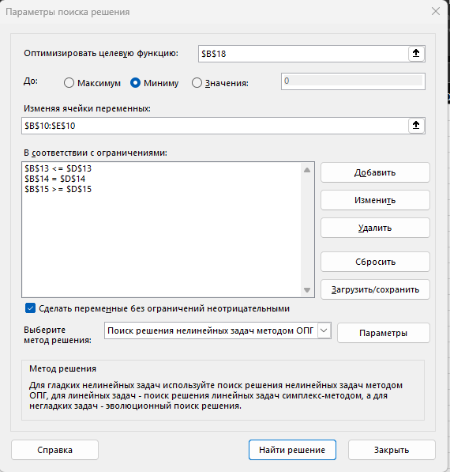
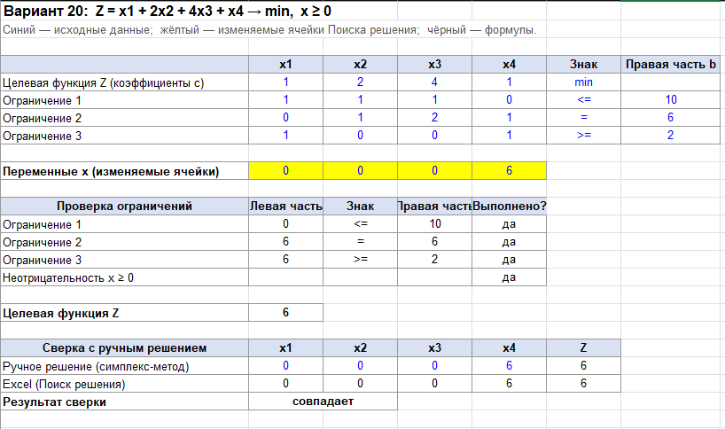

# Лабораторная работа №1. Задачи линейного программирования. Вариант 20

- **Ф.И.О.:** Мурашов Никита Александрович
- **Поток:** МетОпт 1.2
- **Вариант:** 20

## 1. Постановка задачи

Минимизировать

$$Z(x)=x_1+2x_2+4x_3+x_4\to\min$$

при ограничениях

$$
\begin{cases}
x_1+x_2+x_3\le 10,\\
x_2+2x_3+x_4=6,\\
x_1+x_4\ge 2,\\
x_1,x_2,x_3,x_4\ge 0.
\end{cases}
$$

## 2. Приведение к каноническому виду

Целевая функция уже минимизируется, правые части ограничений неотрицательны, все переменные неотрицательны. Остаётся
заменить неравенства равенствами с помощью дополнительных переменных:

- в первое неравенство ($\le$) добавляем $x_5\ge 0$;
- в третье неравенство ($\ge$) вычитаем $x_6\ge 0$.

Канонический вид:

$$Z(x)=x_1+2x_2+4x_3+x_4\to\min$$

$$
\begin{cases}
x_1+x_2+x_3+x_5=10,\\
x_2+2x_3+x_4=6,\\
x_1+x_4-x_6=2,\\
x_1,\dots,x_6\ge 0.
\end{cases}
$$

В первом уравнении есть базисная переменная $x_5$ (коэффициент 1, в остальных уравнениях её нет). Во втором и третьем
уравнениях готового базиса нет ($x_4$ входит в оба уравнения, $x_6$ имеет коэффициент $-1$), поэтому строим
вспомогательную задачу.

## 3. Вспомогательная задача

Вводим искусственные переменные $x_7\ge 0$ во второе уравнение и $x_8\ge 0$ в третье:

$$W'(x')=x_7+x_8\to\min$$

$$
\begin{cases}
x_1+x_2+x_3+x_5=10,\\
x_2+2x_3+x_4+x_7=6,\\
x_1+x_4-x_6+x_8=2,\\
x_1,\dots,x_8\ge 0.
\end{cases}
$$

Базисные переменные: $x_5,x_7,x_8$; свободные: $x_1,x_2,x_3,x_4,x_6$. Выражаем искусственные переменные:

$$x_7=6-x_2-2x_3-x_4,\qquad x_8=2-x_1-x_4+x_6.$$

Подставляем в $W'$:

$$W'=8-x_1-x_2-2x_3-2x_4+x_6,\qquad Q=8.$$

В строке целевой функции записываем коэффициенты $p_j$ и число $-Q$.

**Таблица 0.**

|       | $x_1$ | $x_2$ | $x_3$ | $x_4$ | $x_6$ | $b$ |
|:-----:|:-----:|:-----:|:-----:|:-----:|:-----:|:---:|
| $x_5$ |   1   |   1   |   1   |   0   |   0   | 10  |
| $x_7$ |   0   |   1   |   2   |   1   |   0   |  6  |
| $x_8$ |   1   |   0   |   0   |   1   |  −1   |  2  |
| $W'$  |  −1   |  −1   |  −2   |  −2   |   1   | −8  |

**Шаг 1.**

1. Разрешающий столбец: $\min p_j=-2$ достигается в столбцах $x_3$ и $x_4$; берём $x_3$ (первый из них).
2. Разрешающая строка: отношения $b_i/a_{i3}$ по строкам с $a_{i3}>0$: $x_5$: $10/1=10$; $x_7$: $6/2=3$. Минимум в
   строке $x_7$. Разрешающий элемент $a_{x_7x_3}=2$.
3. Меняем местами $x_7\leftrightarrow x_3$. Столбец искусственной переменной $x_7$ после выхода из базиса больше не
   нужен, вычёркиваем его.

Пересчёт по правилам симплекс-таблицы, например:

$$\hat b_{x_5}=10-\frac{6\cdot 1}{2}=7,\qquad \hat p_{x_4}=-2-\frac{1\cdot(-2)}{2}=-1.$$

**Таблица 1.**

|       | $x_1$ | $x_2$ | $x_4$ | $x_6$ | $b$ |
|:-----:|:-----:|:-----:|:-----:|:-----:|:---:|
| $x_5$ |   1   |  1/2  | −1/2  |   0   |  7  |
| $x_3$ |   0   |  1/2  |  1/2  |   0   |  3  |
| $x_8$ |   1   |   0   |   1   |  −1   |  2  |
| $W'$  |  −1   |   0   |  −1   |   1   | −2  |

**Шаг 2.**

1. Разрешающий столбец: $\min p_j=-1$ в столбцах $x_1$ и $x_4$; берём $x_1$.
2. Разрешающая строка: $x_5$: $7/1=7$; $x_8$: $2/1=2$. Минимум в строке $x_8$, разрешающий элемент равен 1.
3. Меняем $x_8\leftrightarrow x_1$ и вычёркиваем столбец $x_8$.

**Таблица 2.**

|       | $x_2$ | $x_4$ | $x_6$ | $b$ |
|:-----:|:-----:|:-----:|:-----:|:---:|
| $x_5$ |  1/2  | −3/2  |   1   |  5  |
| $x_3$ |  1/2  |  1/2  |   0   |  3  |
| $x_1$ |   0   |   1   |  −1   |  2  |
| $W'$  |   0   |   0   |   0   |  0  |

Отрицательных $p_j$ нет, $W'_{\min}=0$, все искусственные переменные вышли из базиса. Значит, допустимое множество
исходной задачи непусто, и найдено опорное решение

$$x=(2,\ 0,\ 3,\ 0,\ 5,\ 0),\qquad Z=2+4\cdot 3=14.$$

Проверка: $2+0+3+5=10$; $0+6+0=6$; $2+0-0=2$.

## 4. Решение основной задачи симплекс-методом

Базис: $x_5,x_3,x_1$. Выражаем их через свободные переменные $x_2,x_4,x_6$ (строки таблицы 2):

$$x_3=3-\tfrac12x_2-\tfrac12x_4,\qquad x_1=2-x_4+x_6.$$

Подставляем в целевую функцию:

$$
\begin{aligned}
Z&=x_1+2x_2+4x_3+x_4\\
&=(2-x_4+x_6)+2x_2+4\left(3-\tfrac12x_2-\tfrac12x_4\right)+x_4\\
&=14-2x_4+x_6,\qquad Q=14.
\end{aligned}
$$

**Таблица 3** (начальная таблица основной задачи).

|       | $x_2$ | $x_4$ | $x_6$ | $b$ |
|:-----:|:-----:|:-----:|:-----:|:---:|
| $x_5$ |  1/2  | −3/2  |   1   |  5  |
| $x_3$ |  1/2  |  1/2  |   0   |  3  |
| $x_1$ |   0   |   1   |  −1   |  2  |
|  $Z$  |   0   |  −2   |   1   | −14 |

**Шаг 3.**

1. Разрешающий столбец: единственное $p_j<0$ у $x_4$ ($-2$).
2. Разрешающая строка: $x_5$ — пропускаем ($a=-3/2<0$); $x_3$: $3/(1/2)=6$; $x_1$: $2/1=2$. Минимум в строке $x_1$,
   разрешающий элемент 1.
3. Меняем $x_1\leftrightarrow x_4$.

**Таблица 4.**

|       | $x_2$ | $x_1$ | $x_6$ | $b$ |
|:-----:|:-----:|:-----:|:-----:|:---:|
| $x_5$ |  1/2  |  3/2  | −1/2  |  8  |
| $x_3$ |  1/2  | −1/2  |  1/2  |  2  |
| $x_4$ |   0   |   1   |  −1   |  2  |
|  $Z$  |   0   |   2   |  −1   | −10 |

Здесь $Z=10+2x_1-x_6$, текущее решение: $x_5=8,\ x_3=2,\ x_4=2$, $Z=10$.

**Шаг 4.**

1. Разрешающий столбец: единственное $p_j<0$ у $x_6$ ($-1$).
2. Разрешающая строка: $x_5$ и $x_4$ имеют отрицательные элементы (пропускаем); $x_3$: $2/(1/2)=4$. Разрешающая
   строка $x_3$, разрешающий элемент $1/2$.
3. Меняем $x_3\leftrightarrow x_6$.

**Таблица 5** (итоговая).

|       | $x_2$ | $x_1$ | $x_3$ | $b$ |
|:-----:|:-----:|:-----:|:-----:|:---:|
| $x_5$ |   1   |   1   |   1   | 10  |
| $x_6$ |   1   |  −1   |   2   |  4  |
| $x_4$ |   1   |   0   |   2   |  6  |
|  $Z$  |   1   |   1   |   2   | −6  |

Все $p_j\ge 0$, критерий оптимальности выполнен. Свободные переменные $x_1=x_2=x_3=0$,
тогда $x_5=10$, $x_6=4$, $x_4=6$, $Q=6$.

$$x^*=(0,\ 0,\ 0,\ 6),\qquad Z_{\min}=Z(x^*)=6.$$

Проверка по исходным ограничениям: $0\le 10$; $0+0+6=6$; $0+6=6\ge 2$ — выполнены.

Оптимум единственный: в итоговой таблице все $p_j$ свободных переменных строго положительны ($1,1,2$), поэтому любое
отклонение от $x_1=x_2=x_3=0$ увеличивает $Z$.

### Проверка без симплекс-метода

Из второго ограничения $x_4=6-x_2-2x_3$. Подставим в $Z$:

$$Z=x_1+2x_2+4x_3+(6-x_2-2x_3)=6+x_1+x_2+2x_3\ \ge 6,$$

так как $x_1,x_2,x_3\ge 0$. Равенство только при $x_1=x_2=x_3=0$, откуда $x_4=6$. Результат совпадает.

## 5. Двойственная задача

Прямая задача на минимум; каждому ограничению ставим в соответствие двойственную переменную:
первому ($\le$) — $y_1\le 0$, второму ($=$) — $y_2$ без ограничения знака, третьему ($\ge$) — $y_3\ge 0$. Двойственная
задача:

$$W(y)=10y_1+6y_2+2y_3\to\max$$

$$
\begin{cases}
y_1+y_3\le 1,\\
y_1+y_2\le 2,\\
y_1+2y_2\le 4,\\
y_2+y_3\le 1,\\
y_1\le 0,\ y_3\ge 0,\ y_2\ \text{свободна}.
\end{cases}
$$

Рассмотрим $y^*=(0,1,0)$. Ограничения выполняются: $0\le 1$; $1\le 2$; $2\le 4$; $1\le 1$. Значение $W(y^*)=6$ совпадает
с $Z_{\min}=6$, поэтому по теореме двойственности $y^*$ оптимально.

Условия дополняющей нежёсткости выполнены:

- слабина первого ограничения: $10-0>0$, и $y_1=0$;
- слабина третьего ограничения: $(0+6)-2=4>0$, и $y_3=0$;
- для $x_4^*=6>0$ четвёртое ограничение двойственной задачи обращается в равенство: $y_2+y_3=1$.

## 6. Целочисленная задача

Пусть дополнительно $x_i\in\mathbb Z$. Допустимое множество целочисленной задачи лежит внутри допустимого множества
непрерывной, поэтому для любой целой допустимой точки $Z=6+x_1+x_2+2x_3\ge 6$. Точка $(0,0,0,6)$ целочисленна и
допустима, значит она оптимальна и в целочисленной задаче:

$$x^*=(0,0,0,6),\qquad Z_{\min}=6.$$

## 7. Решение в Excel

## 8. Ответ

Оптимальная точка и значение целевой функции в ней:

$$x^*=(0,\ 0,\ 0,\ 6),\qquad Z(x^*)=6.$$

Оптимум единственный. Решение двойственной задачи $y^*=(0,1,0)$ даёт то же значение $6$, целочисленный оптимум совпадает
с непрерывным.

## 9. Рефлективный вывод

Решал по шаблону из файла «Задачи линейного программирования 26 сентября». Во время решения разговаривал с подругой,
которой задача показалась интересной. Сам симплекс-метод ей был не особо интересен, поэтому она просто взяла $x_2=0$
и $x_3=-t$, где $t\ge 0$, привела целевую функцию к виду $Z=2-4t$ и получила, что $Z\to-\infty$. В то же время я
продолжал оформлять решение и отчёт, что заняло гораздо больше времени. Это было до того, как Вы сказали, что переменные
неотрицательные.)